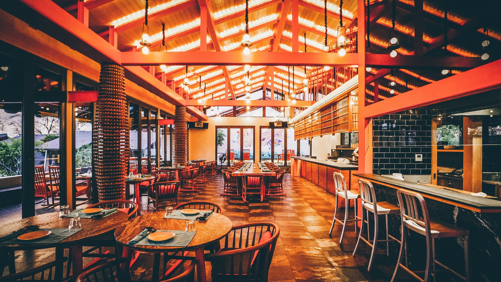

# SQL-Projects
The Repo will Houses all my sql Project

## Introduction
This Project is going to be answering the danny ma sql first challenge that deals with Danny Ma dinner Resturant

## problem statement
1. What is the total amount each customer spent at the restaurant? 
2. What is the total amount each customer spent at the restaurant?
3. What is the total amount each customer spent at the restaurant?

## skills demonstrtated
I will using postgres to write my sql. i wil b ew using left join, right join

## data sourcing
You will get to see my data souce on the script

## data transforming
employee           |       salary
:-----------------:|:-----------:
              | 

## modelling
you can read more about modelling [shit](https://techcommunity.microsoft.com/t5/educator-developer-blog/github-for-data-analyst-and-power-platform-developers/ba-p/3719651?wt.mc_id=1reg_S-1087_webpage_reactor)

Analysis& visualization
1. What is the total amount each customer spent at the restaurant? 
2. What is the total amount each customer spent at the restaurant?
3. What is the total amount each customer spent at the restaurant?

- What is the total amount each customer spent at the restaurant?
-What is the total amount each customer spent at the restaurant?
conclusion and recomendation
